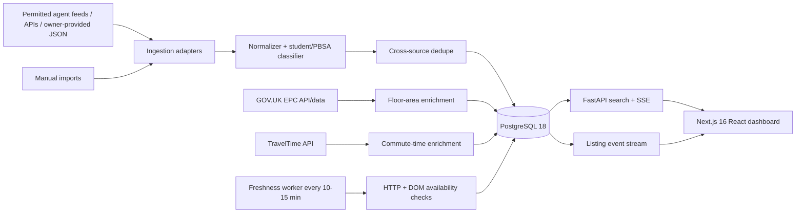

# Notts Rental Tracker

A real-time rental finder for working professionals/non-students in Nottinghamshire.

## Hard search policy

Every result shown in the default strict view must satisfy:

- exactly 2 bedrooms;
- rent <= £1,000 pcm;
- verified floor area >= 600 sq ft;
- not PBSA;
- not student-only / academic-year-only;
- active and freshly verified;
- located in Nottinghamshire / Nottingham city, with ranking boosts for NG1, NG2, NG3, NG5, NG7 fringe and the NG9 tram corridor;
- ranked by public-transport commute to Old Market Square.

Listings with unknown floor area are **not** allowed into strict results. They can be inspected separately after an EPC/floorplan enrichment step.

## Architecture



### Why this split

- **Next.js/React:** interactive filter UI, live search, SSE refreshes.
- **FastAPI:** search API, async enrichment, feed adapters, HTTP/DOM verification.
- **PostgreSQL:** source listings, canonical properties, dedupe keys, freshness history, listing events.
- **Dedicated worker:** one process owns 10-15 minute polling so API replicas never duplicate work.
- **TravelTime:** public-transport commute calculations to Old Market Square.
- **EPC open data:** fills floor area when the advert omits it.

## Portal access policy

Do not enable a scraper for a portal unless its current terms and robots policy permit the exact automation or you have written/API access. The code intentionally provides generic adapters and generic availability selectors rather than hard-coding a prohibited portal scraper.

## Run locally

```bash
cp .env.example .env
docker compose up --build
```

Open:

- dashboard: http://localhost:3000
- API docs: http://localhost:8000/docs

Seed fictional demo data:

```bash
docker compose exec api python -m app.seed
```

## API examples

```bash
curl 'http://localhost:8000/api/v1/listings?max_rent=1000&min_sqft=600&max_commute=30'
```

## Freshness rules

Archive immediately only on a strong stale signal:

1. HTTP 404 or 410;
2. explicit permitted DOM selector for `let agreed`, `removed`, or `unavailable`;
3. explicit page text proving the listing is no longer available.

A 403, 429, timeout, TLS error, or anti-bot page is **not** treated as removed. Those become `UNKNOWN` and are retried.

## Next implementation steps

1. Connect the first permitted live source/feed.
2. Add EPC address matching with confidence scores.
3. Add TravelTime credentials and nightly commute refresh.
4. Add authentication/watchlists/notifications.
5. Push to GitHub and enable CI.


## Live internet discovery (Step 2)

The worker now supports server-side live web discovery through Brave Search's LLM Context endpoint. This endpoint returns URLs and pre-extracted relevant page chunks, so the app does not scrape search-result HTML.

1. Create a Brave Search API token and set `BRAVE_SEARCH_API_KEY` in `.env`.
2. Run `docker compose up --build`.
3. Open `http://localhost:3000` and click **Search internet now**, or let the worker search every 10–15 minutes.

The discovery service runs separate queries for NG1, NG2, NG3, NG5, NG7 and NG9, then only ingests candidates that explicitly satisfy all of: exactly 2 bedrooms, rent <= £1,000 pcm, floor area >= 600 sq ft, an NG postcode, and no PBSA/student-only/academic-year language. Weak or ambiguous web results are discarded.

### Freshness modes

`DIRECT_VERIFY_ALLOWED_DOMAINS` is a comma-separated allowlist of listing hosts for which you have permission to poll the source page directly. Those hosts get HTTP/DOM checks each worker cycle and can be archived immediately on 404/410 or explicit `Let Agreed`/removed markers. Other web-discovered records use conservative search-index revalidation and are marked as such in the UI; search indexes can lag, so they should not be represented as 10-minute source-verified availability.

Example:

```env
BRAVE_SEARCH_API_KEY=...
DIRECT_VERIFY_ALLOWED_DOMAINS=agent-one.example,agent-two.example
```


### Local API smoke test without Docker

For a dependency-light local backend smoke test, PostgreSQL can be temporarily replaced by SQLite while keeping PostgreSQL as the production architecture:

```bash
export DATABASE_URL=sqlite:///./local-dev.db
export PYTHONPATH=backend
python -m app.seed
uvicorn app.main:app --host 127.0.0.1 --port 8000
```

Then open `http://127.0.0.1:8000/docs` for the FastAPI UI. The production Docker configuration continues to use PostgreSQL.
